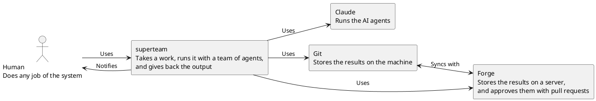

# Context

The system is `superteam`. It takes a work and gives back the output of the
work, with a team of agents. An actor is a human.

```plantuml
@startuml
left to right direction
actor "Human\nDoes any job of the system" as human
rectangle "superteam\nTakes a work, runs it with a team of agents,\nand gives back the output" as superteam
rectangle "Claude\nRuns the AI agents" as claude
rectangle "Git\nStores the results on the machine" as git
rectangle "Forge\nStores the results on a server,\nand approves them with pull requests" as forge

human --> superteam : Uses
superteam --> human : Notifies
superteam --> claude : Uses
superteam --> forge : Uses
superteam --> git : Uses
git <--> forge : Syncs with
@enduml
```
