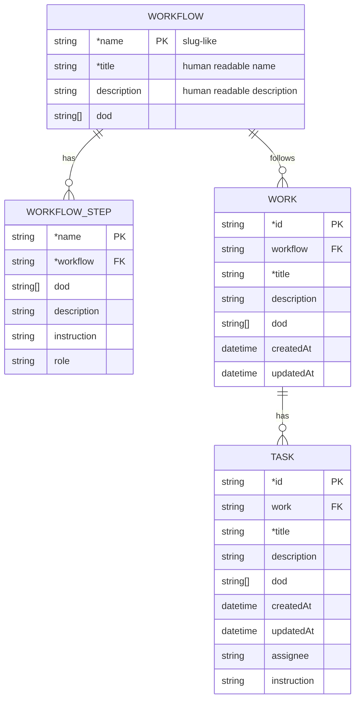

# Data structure

A field whose name starts with `*` is required.

```mermaid
erDiagram
    WORKFLOW {
        string *name PK "slug-like"
        string *title "human readable name"
        string description "human readable description"
        string[] dod
    }

    WORKFLOW_STEP {
        string *name PK
        string *workflow FK
        string[] dod
        string description
        string instruction
        string role
    }

    WORK {
        string *id PK
        string workflow FK
        string *title
        string description
        string[] dod
        datetime createdAt
        datetime updatedAt
    }

    TASK {
        string *id PK
        string work FK
        string *title
        string description
        string[] dod
        datetime createdAt
        datetime updatedAt
        string assignee
        string instruction
    }

    WORKFLOW ||--o{ WORKFLOW_STEP : has
    WORKFLOW ||--o{ WORK : follows
    WORK ||--o{ TASK : has
```
